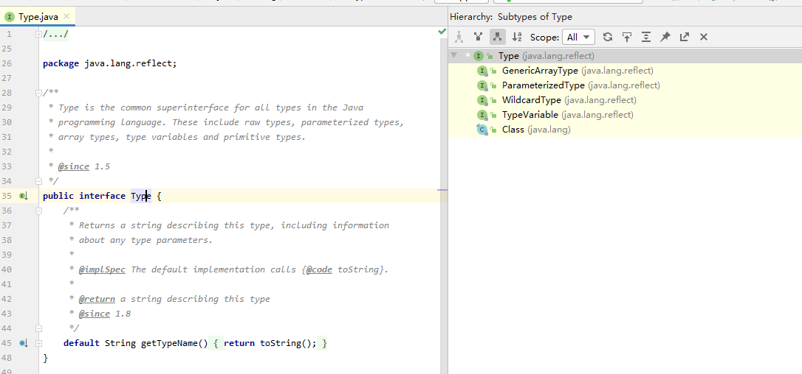

### 反射

> 反射与泛型的Type体系

对一个泛型类进行反射获取泛型中的真实的数据类型，此时需要通过Type体系来完成



所以Type的孩子有4个接口+1个实现类


> ParameterizedType 参数化类型

具体对应的类型如Map<String,Integer>

有如下方法：

1. Type[] getActualTypeArguments();

   返回实际泛型类型列表，如上面的Map<String,Integer>则返回String，Integer

2. Type getRawType()

   返回承载该泛型的类或接口

3. Type getOwnerType();

   获取泛型拥有者，这个拥有者是指内部类的父亲

   比如存在内部类O.I，那么这个拥有者就是O

```java
public class TestType<K extends Comparable & Serializable, V> {

    K key;
    V value;
    String age;
    Map<String, Integer> map = new HashMap<>();
    Map.Entry<Double,String> entry;

    public static void main(String[] args) throws Exception {

        Field mapField = TestType.class.getDeclaredField("map");
        ParameterizedType pt = (ParameterizedType)mapField.getGenericType();
        System.out.println(pt.getRawType());//TODO interface java.util.Map
        System.out.println(pt.getOwnerType());//TODO  null  Map本身不是谁的内部类所以没有拥有者
        for (Type actualTypeArgument : pt.getActualTypeArguments()) {
            System.out.println(actualTypeArgument);
            //TODO class java.lang.String  
            //TODO class java.lang.Integer
        }

        Field entryField  = TestType.class.getDeclaredField("entry");
        ParameterizedType pt2 = (ParameterizedType)entryField.getGenericType();
 		//TODO interface java.util.Map  
        //TODO Entry是Map的内部类所以拥有者是Map
         System.out.println(pt2.getOwnerType());

    }
}

```


> TypeVariable 类型变量

TypeVariable是指声明中的<T>、<C extends Collection>这些中的T、C

它有如下方法：

1. Type[] getBounds() 获取泛型的上边界，未声明的默认是Object
2. D getGenericDeclaration(); 获取承载泛型的宿主
3. String getName();
4. AnnotatedType[] getAnnotatedBounds();

```java
package com.silang.javalib;

import java.io.Serializable;
import java.lang.reflect.Field;
import java.lang.reflect.ParameterizedType;
import java.lang.reflect.Type;
import java.lang.reflect.TypeVariable;
import java.util.HashMap;
import java.util.Map;

public class TestType<K extends Comparable & Serializable, V,Q> {


    Map<String, Integer> map = new HashMap<>();
    Map<K,V> kvMap;

    public static void main(String[] args) throws Exception {

        Field mapField = TestType.class.getDeclaredField("map");
        ParameterizedType pt = (ParameterizedType)mapField.getGenericType();
        System.out.println("****************************");
        for (Type actualTypeArgument : pt.getActualTypeArguments()) {
            System.out.println(actualTypeArgument.getClass().getName());
            System.out.println(actualTypeArgument);
        }
        System.out.println("****************************");


        Field kvMapField = TestType.class.getDeclaredField("kvMap");
        ParameterizedType kvType = (ParameterizedType)kvMapField.getGenericType();
        System.out.println("############################");
        for (Type actualTypeArgument : kvType.getActualTypeArguments()) {
            System.out.println(actualTypeArgument.getClass().getName());
            System.out.println(actualTypeArgument);
        }
        System.out.println("############################");

    }
}

```

**输出**：

/*** ***************************************

java.lang.Class
class java.lang.String
java.lang.Class
class java.lang.Integer

/** **************************************

############################
sun.reflect.generics.reflectiveObjects.TypeVariableImpl
K
sun.reflect.generics.reflectiveObjects.TypeVariableImpl
V
############################

Map<String,Integer>与Map<K,V>是有区别的


```java
public class TestType<K extends Comparable & Serializable, V,Q> {

    K key;
    V value;
    
    public static void main(String[] args) throws Exception {
        
        Field keyField = TestType.class.getDeclaredField("key");
        TypeVariable keytv = (TypeVariable) keyField.getGenericType();
        for (Type bound : keytv.getBounds()) {
            System.out.println(bound);
            //TODO interface java.lang.Comparable
            //TODO interface java.io.Serializable
        }

        //TODO class com.silang.javalib.TestType
        System.out.println(keytv.getGenericDeclaration());

        System.out.println(keytv.getName());//TODO K

    }
}
```


> GenericArrayType 泛型数组

对应泛型数组类型，比如List<String>[]、T[]

```java
public class MyClass<T> {

    List<String>[] listArray;
    T[] t;

    public static void main(String[] args) throws Exception {

        Field listArrayField = MyClass.class.getDeclaredField("listArray");
        Type listArrayType = listArrayField.getGenericType();
        //TODO sun.reflect.generics.reflectiveObjects.GenericArrayTypeImpl
        System.out.println(listArrayType.getClass().getTypeName());


        Field tField = MyClass.class.getDeclaredField("t");
        Type tType = tField.getGenericType();
        //TODO sun.reflect.generics.reflectiveObjects.GenericArrayTypeImpl
        System.out.println(tType.getClass().getTypeName());

    }

}
```

<https://mp.weixin.qq.com/s?src=3×tamp=1595195680&ver=1&signature=b1BrTvreiCRq8cd5MvCp4rtefuzjbTgTPSi6yhsoUR7CBBv-jmxlFRkWpmrVJ-OsgvmZAai2X6hUvlQc8thX5LDuW4xzhxcf-Pd27gnIPu8xMTgS0GGFpEmf03vSyWzZLOjxUqZ87ZdzRe6HH0jdKeNqTb-VWdOt3en-WNkNqZY=>