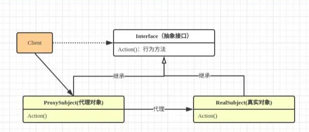

### 手写Retrofit


> 静态代理模式





Client与真实的对象不直接接触，被代理对象隔离，对于真实对象可以根据需要灵活的替换，比如第三方框架使用一般会做代理，方便日后同类框架无缝替换


静态代理的问题：

不能代理多个接口，即一个代理类只能代理一个接口

> 类的完整生命周期


> 动态代理

一个代理类只能代理多个接口，但是只能代理接口

动态代理的本质实际上就是动态生成Class文件的数据，然后直接在内存中生成对象

**API解析**

```java
Proxy.newProxyInstance(ClassLoader var0, Class<?>[] var1, InvocationHandler var2)
```

 var0：一个ClassLoader对象，定义了由哪个ClassLoader对象来对生成的代理对象进行加载

var1：一个Interface对象的数组，表示为那些接口提供代理

var2：一个InvocationHandler对象，当动态代理对象在调用方法的时候，这个对象的方法会被回调


源码分析：


> 手写Retrofit


2-3249


利用反射、注解、动态代理实现OnClick事件的自动注入