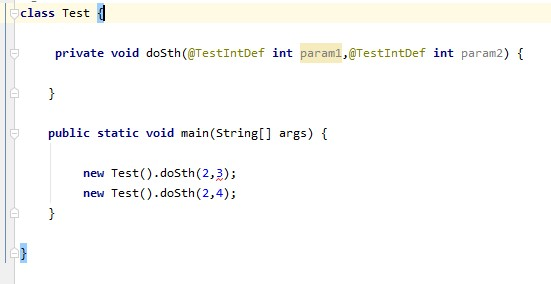

### 注解基础扫盲


> 元注解

标注注解的注解


> 注解的使用场景

| 保留级别 | 使用场景                                                  |
| -------- | --------------------------------------------------------- |
| Source   | Apt(Butterknife、Dagger)生成辅助类，IDE语法检查（@IdRes） |
| Class    | 字节码插桩AOP                                             |
| Runtime  | 反射                                                      |


> Android annotation提供的注解@IntDef

Indef是元注解，

```java
@Retention(SOURCE)
@Target({ANNOTATION_TYPE})
public @interface IntDef {
    /** Defines the allowed constants for this element */
    //TODO 表示被这个IntDef标记的注解本身可以取的值
    int[] value() default {};

    boolean flag() default false;

    boolean open() default false;
}
```

demo:

```java
//自定义一个注解
//这个注解的值只能取 2 4 6
@IntDef({2,4,6})
//注解用在参数上
@Target(ElementType.PARAMETER)
@Retention(RetentionPolicy.SOURCE)
public @interface TestIntDef {
}

```



可以看到当传入3时会报错，这就是Ide的语法检查


> 使用Android annotation 优化代码


利用反射、注解、动态代理实现OnClick事件的自动注入